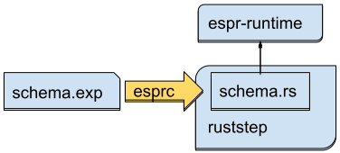

Architecture
=============

This document describes the high-level architecture of ruststep project for new developers.

Parser combinator
------------------

Tokenize phase of both EXPRESS language parser and STEP file parsers heavily depend on the [nom][nom] parser combinator.
You should be familiar with it before touching parser parts of this project.
There is [a tutorial][nom-tutorial].

[nom]: https://docs.rs/nom/latest/nom/
[nom-tutorial]: https://github.com/benkay86/nom-tutorial

EXPRESS Language compiler (esprc)
----------------------------------



- Compilation in `espr` crate has three phases
  - **Tokenize**: Read the EXPRESS language files (usually named as `*.exp`), and parse into abstract syntax tree (AST).
  - **Legalize**: Convert AST to IR (intermediate representation) to ready the following code generation
    - Look up the references in AST
    - Resolve sub/super relations between entities
  - **Code Generation**: Create Rust module which will be used for STEP file I/O

STEP file I/O
--------------

Exchange structure, or STEP file is a data serialization format consists of following sections:

- Header
- Anchor (optional)
- Reference (optional)
- Data
- Signature (optional)

Data section consists of data definitions like following (from ISO-10303-21):

```
#2 = WIDGET(99, 99999, 'ABC', 'ABCDEFG', .T., .F., 9., 1.2345, @10, @PI);
```

This defines an entity instance `#2`, whose type is `WIDGET` and its value consists of values in the parenthesis.
`@10` is a reference to the instance `#10`, and it may be another type.
`.XXX.` is an enum value, e.g. `.T.` means `True` boolean value.
The definition of `WIDGET` type is not contained in the STEP file, and will be given in external EXPRESS schemas.

Because of the non-exclusive reference between entity instances, the data structure expressed by the exchange structure must be a graph.
Since the STEP files are usually very large file, we hope to parse them in streaming way without loading entire data on memory.
To realize these requirements, STEP file is parsed into several tables. Roughly, following a data section

```
DATA;
  #1 = A(1, 2);
  #2 = A(3, 4);
  #3 = B(5, @1);
  #4 = B(6, @1);
  #5 = B(5, @2);
ENDSEC;
```

will be parsed into two tables:

| Table A | value1 | value2 |
|:--------|:-------|:-------|
| `#1`    | 1      | 2      |
| `#2`    | 3      | 4      |

| Table B | value3 | @A     |
|:--------|:-------|:-------|
| `#3`    | 5      | 1      |
| `#4`    | 6      | 1      |
| `#5`    | 5      | 2      |

We may be able to built dynamically these tables only from a STEP file,
however, we create these tables statically from EXPRESS schema.

```
ENTITY a;
  x: INTEGER;
  y: INTEGER;
END_ENTITY;

ENTITY b;
  z: INTEGER;
  w: a;
END_ENTITY;
```

| Table (a) | x (int) | y (int) |
|:----------|:--------|:--------|
| `#1`      | 1       | 2       |
| `#2`      | 3       | 4       |

| Table (b) | z (int) | w (a) |
|:----------|:--------|:------|
| `#3`      | 5       | 1     |
| `#4`      | 6       | 1     |
| `#5`      | 5       | 2     |
